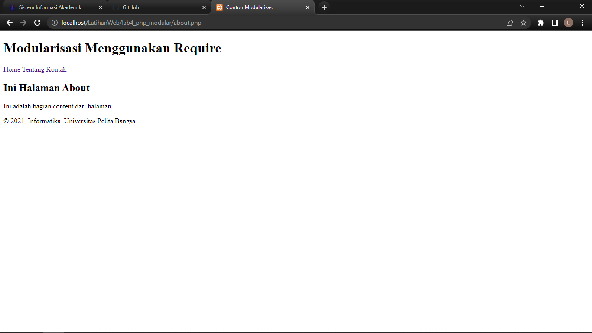
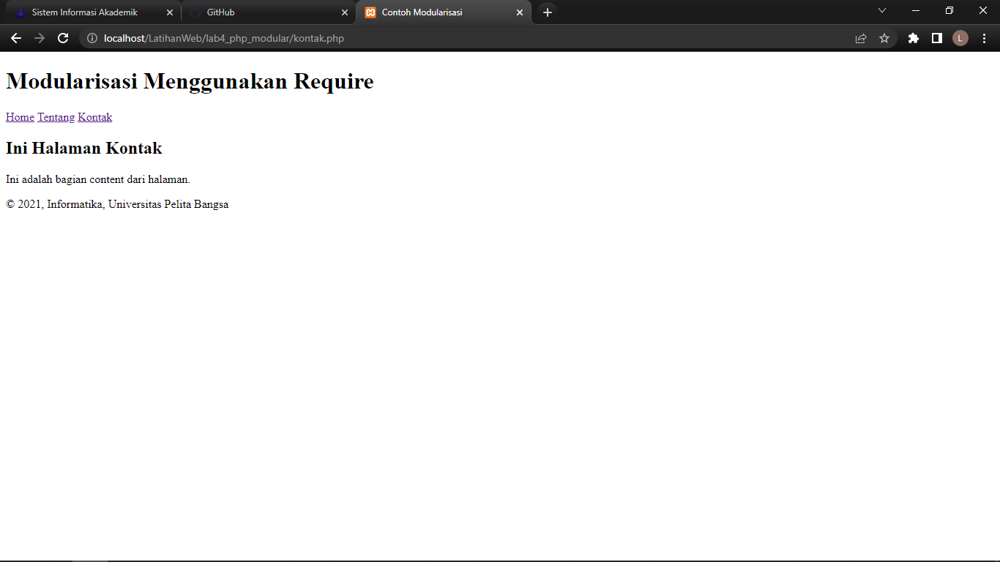

# lab4_php_modular
## Php Modular
1. buat file header.php
    ```php
    <!DOCTYPE html>
    <html lang="en">
    <head>
        <meta charset="UTF-8">
        <title>Contoh Modularisasi</title>
        <link href="style.css" rel="stylesheet" type="text/stylesheet" media="screen" />
    </head>
    <body>
        <div class="container">
            <header>
                <h1>Modularisasi Menggunakan Require</h1>
            </header>
            <nav>
                <a href="home.php">Home</a>
                <a href="about.php">Tentang</a>
                <a href="kontak.php">Kontak</a>
            </nav>
    ```
2. Buat file footer.php
    ```php
    <footer>
        <p>&copy; 2021, Informatika, Universitas Pelita Bangsa</p>
    </footer>
    </div>
    </body>
    </html>
    ```
3. buat file home.php untuk mengakses halaman HOME
    ```php
    <?php require('header.php'); ?>
    <div class="content">
    <h2>Ini Halaman Home</h2>
    <p>Ini adalah bagian content dari halaman.</p>
    </div>
    <?php require('footer.php'); ?>
    ```
    <b>Hasil</b><br>
   
4. buat file about.php untuk mengakses halaman ABOUT
    ```php
    <?php require('header.php'); ?>
    <div class="content">
        <h2>Ini Halaman About</h2>
        <p>Ini adalah bagian content dari halaman.</p>
    </div>
    <?php require('footer.php'); ?>
    ```
    <b>Hasil</b><br>
   
5. buat file kontak.php untuk mengakses halaman KONTAK
    ```php
    <?php require('header.php'); ?>
    <div class="content">
        <h2>Ini Halaman Kontak</h2>
        <p>Ini adalah bagian content dari halaman.</p>
    </div>
    <?php require('footer.php'); ?>
    ```
    <b>Hasil</b><br>
   
